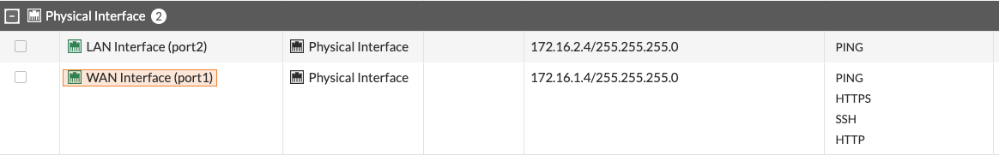
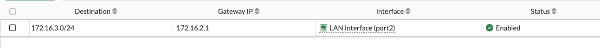
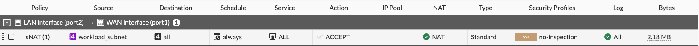
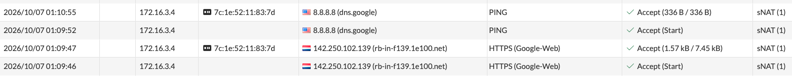

# FortiGate Azure p2s VPN

## Overview

This lab deploys a FortiGate-VM in Microsoft Azure as a Network Virtual Appliance (NVA), with a private Linux workload behind it.

The initial goal is to understand and validate the Azure/FortiGate networking behavior manually before automating the FortiGate configuration.

The environment itself is deployed with Terraform so that it can be created and destroyed as needed.

The lab is being built in two main phases:

1. Validate workload routing through FortiGate.
2. Configure FortiClient remote-access IPsec VPN and access the private workload through FortiGate.

Once the complete configuration works, the FortiGate configuration will also be automated with Terraform.

---

## Target Architecture

```text
                         Internet
                            |
                     Azure Public IP
                            |
                  FortiGate port1 (WAN)
                     172.16.1.4/24
                            |
                       [ FortiGate ]
                            |
                  FortiGate port2 (LAN)
                     172.16.2.4/24
                            |
                      Azure Fabric
                            |
                 Workload subnet / UDR
                     172.16.3.0/24
                            |
                     Linux workload
                       172.16.3.4
```

The final remote-access flow will be:

```text
 FortiClient (macos/windows)
       |
       | IPsec
       v
    Internet
       |
       v
 Azure Public IP
       |
       v
 FortiGate port1
       |
       | IPsec termination
       v
   FortiGate
       |
       v
 Azure Fabric
       |
       v
 Workload subnet
       |
       v
 Linux VM
 172.16.3.4
```

---

## Azure Network

The lab uses the following address space:

| Component | Address |
| --- | --- |
| VNet | `172.16.0.0/16` |
| WAN subnet | `172.16.1.0/24` |
| FortiGate port1 | `172.16.1.4` |
| LAN / transit subnet | `172.16.2.0/24` |
| FortiGate port2 | `172.16.2.4` |
| Workload subnet | `172.16.3.0/24` |
| Linux workload | `172.16.3.4` |
| Planned VPN client pool | `10.20.0.0/24` |

The FortiGate WAN NIC has an Azure Public IP associated with it.

Both FortiGate NICs have Azure IP forwarding enabled.

The Linux workload has no Public IP.

---

## FortiGate VM

FortiGate is deployed with Terraform using the Azure Marketplace image.

This allows the Azure infrastructure, NICs, IP addresses and VM configuration to remain under Terraform control.

### Marketplace Image

```hcl
source_image_reference {
  publisher = "fortinet"
  offer     = "fortinet_fortigate-vm"
  sku       = "fortinet_fg-vm_payg_76_g2"
  version   = "latest"
}

plan {
  name      = "fortinet_fg-vm_payg_76_g2"
  publisher = "fortinet"
  product   = "fortinet_fortigate-vm"
}
```

The image is:

```text
FortiGate PAYG
FortiOS 7.6
Generation 2
```

In order to balance the cost with Fortinet requirements, the selected VM size is:

```text
Standard_D2als_v6
```

### FortiGate Interfaces

FortiGate currently sees the two Azure NICs correctly:




Their roles are:

```text
port1 -> WAN
port2 -> LAN / Azure transit
```

`port1` is also currently used for FortiGate management (ssh, http/https allowed).

---

## FortiGate Azure Authentication

The FortiGate VM is deployed using `azurerm_linux_virtual_machine`.

Password authentication must be explicitly enabled:

```hcl
admin_username                  = "localadmin"
admin_password                  = var.fortigate_admin_password
disable_password_authentication = false
```

`disable_password_authentication` defaults to `true` for the Terraform Azure Linux VM resource.

Without explicitly setting it to `false`, password authentication does not work even when `admin_password` is supplied.

The FortiGate GUI can then be accessed using:

```text
Username: localadmin
Password: <Terraform configured password>
```
---

## Network Security

An Azure Network Security Group protects the FortiGate WAN side.

For management, HTTPS is currently required:

```text
TCP/443
```

SSH may optionally be enabled:

```text
TCP/22
```

The Fortinet Marketplace template also includes ports for services such as HTTP, DNS and FortiManager.

FortiManager uses:

```text
TCP/541
```

FortiManager is not used in this project, so TCP/541 is not required.

For the future remote-access IPsec VPN, the WAN NSG will need at least:

```text
UDP/500   IKE
UDP/4500  IPsec NAT-T
```

Management ports should ultimately be restricted to trusted source IP addresses rather than exposed to all Internet sources.

---

# Workload VM

The Linux workload is deployed into:

```text
172.16.3.0/24
```

Current workload IP:

```text
172.16.3.4
```

The VM has no Azure Public IP.

---

## Linux Routing

The Linux VM receives its network configuration from Azure DHCP.

The guest routing table currently contains:

```text
default via 172.16.3.1 dev eth0 proto dhcp src 172.16.3.4 metric 100

168.63.129.16 via 172.16.3.1 dev eth0 proto dhcp src 172.16.3.4 metric 100

169.254.169.254 via 172.16.3.1 dev eth0 proto dhcp src 172.16.3.4 metric 100

172.16.3.0/24 dev eth0 proto kernel scope link src 172.16.3.4 metric 100

172.16.3.1 dev eth0 proto dhcp scope link src 172.16.3.4 metric 100
```

From the Linux VM perspective, its default gateway is therefore:

```text
172.16.3.1
```

This is the Azure virtual gateway for the subnet.
The guest only knows:

```text
Linux
172.16.3.4
    |
    v
172.16.3.1
Azure virtual gateway
```

Azure Fabric applies the User Defined Route after receiving the packet from the VM.

---

# Azure User Defined Route

The route table associated with the workload subnet contains:

```text
Destination:   0.0.0.0/0
Next Hop Type: Virtual Appliance
Next Hop IP:   172.16.2.4
```

This forces workload traffic toward FortiGate.

The resulting path is:

```text
Linux
172.16.3.4
    |
    | default gateway
    v
172.16.3.1
Azure Fabric
    |
    | UDR
    | 0.0.0.0/0
    v
172.16.2.4
FortiGate port2
```
---

# FortiGate Internal Routing

Initially, the FortiGate routing table contained:

```text
S*  0.0.0.0/0
    via 172.16.1.1
    port1

S   168.63.129.16/32
    via 172.16.1.1
    port1

S   169.254.169.254/32
    via 172.16.1.1
    port1

C   172.16.1.0/24
    directly connected
    port1

C   172.16.2.0/24
    directly connected
    port2
```

There was no route for:

```text
172.16.3.0/24
```

---

## LAN vs Transit Network

This is an important difference compared with a traditional on-premises firewall deployment.

In a traditional environment, the FortiGate LAN interface might be directly connected to the server LAN:

```text
FortiGate LAN
192.168.10.1/24
       |
       +--- Server
            192.168.10.10
```

The entire server network is directly connected to the firewall.

In this Azure design, `port2` is connected to a dedicated transit subnet:

```text
FortiGate
port2
172.16.2.4/24
      |
      | Transit subnet
      | 172.16.2.0/24
      |
 Azure Fabric
      |
      +-------------------
      |
 Workload subnet
 172.16.3.0/24
      |
 Linux
 172.16.3.4
```

So:

```text
172.16.2.0/24
```

is not the workload LAN.

It is the transit network between FortiGate and Azure Fabric. The actual workload network is:

```text
172.16.3.0/24
```

---

# FortiGate Return Route

Because `172.16.3.0/24` is not directly connected, FortiGate requires a route back to the workload subnet.

The Azure gateway for the FortiGate LAN/transit subnet is:

```text
172.16.2.1
```

The required route is:

```text
172.16.3.0/24
    |
    v
172.16.2.1
    |
    v
port2
```

FortiGate configuration:

```text
config router static
    edit 0
        set dst 172.16.3.0 255.255.255.0
        set gateway 172.16.2.1
        set device "port2"
    next
end
```
or in GUI:


Without this route, FortiGate uses its default route for traffic returning to `172.16.3.4`:

```text
0.0.0.0/0
    -> 172.16.1.1
    -> port1
```

which sends the return traffic in the wrong direction.

After adding the route, connectivity from the Linux VM to the FortiGate LAN interface is successfully validated:

```text
172.16.3.4 (Linux VM)
    |
    v
172.16.2.4 (LAN - Fortigate)
```

---

# FortiGate Workload Address Object

The workload network is represented by a dedicated FortiGate address object.

```text
config firewall address
    edit "workload-subnet"
        set subnet 172.16.3.0 255.255.255.0
        set associated-interface "port2"
    next
end
```

This represents:

```text
workload-subnet = 172.16.3.0/24
```

It is important not to use the automatically generated:

```text
port2 address
```

object for workload traffic.

The `port2 address` object represents the directly connected network:

```text
172.16.2.0/24
```

but the actual workload traffic originates from:

```text
172.16.3.0/24
```

---

# FortiGate Internet Policy

To allow workload traffic to access the Internet, a firewall policy is configured from:

```text
port2 -> port1
```

The logical policy is:

```text
Incoming Interface: port2
Outgoing Interface: port1

Source:
    workload-subnet
    172.16.3.0/24

Destination:
    all

Schedule:
    always

Service:
    ALL

Action:
    ACCEPT

NAT:
    ENABLED
```

Equivalent FortiGate configuration:

```text
config firewall policy
    edit 1
        set name "sNAT"
        set srcintf "port2"
        set dstintf "port1"
        set action accept
        set srcaddr "workload-subnet"
        set dstaddr "all"
        set schedule "always"
        set service "ALL"
        set logtraffic all
        set logtraffic-start enable
        set nat enable
        set port-preserve disable
    next
end
```



SNAT uses the FortiGate outgoing WAN interface address.

Conceptually:

```text
172.16.3.4
Linux
    |
    v
FortiGate port2
172.16.2.4
    |
    | SNAT
    | 172.16.3.4 -> 172.16.1.4
    v
FortiGate port1
172.16.1.4
    |
    v
Azure Public IP
    |
    v
Internet
```

---


# Validated Workload Data Path

The following complete data path is working:

```text
Linux workload (ping 8.8.8.8, curl https://google.com)
172.16.3.4
       |
       | Linux default route
       | gateway 172.16.3.1
       v
Azure Fabric
       |
       | UDR
       | 0.0.0.0/0
       | Virtual Appliance
       | 172.16.2.4
       v
FortiGate port2
172.16.2.4
       |
       | Firewall Policy
       | workload-subnet -> all
       | ACCEPT
       | SNAT enabled
       v
FortiGate port1
172.16.1.4
       |
       | Azure Public IP mapping
       v
Internet
```

The return path is:

```text
Internet
    |
    v
FortiGate port1
172.16.1.4
    |
    | FortiGate route
    | 172.16.3.0/24
    | via 172.16.2.1
    v
FortiGate port2
172.16.2.4
    |
    v
Azure Fabric
    |
    v
Linux workload
172.16.3.4
```
visible also from captured traffic:


---

# Current Status

## Completed

The following components have been deployed:

- Terraform-managed Resource Group
- Azure VNet
- WAN subnet
- LAN/transit subnet
- Workload subnet
- Azure Route Table
- Workload subnet UDR
- FortiGate WAN NIC
- FortiGate LAN NIC
- Static private IPs for FortiGate
- Azure Public IP on the FortiGate WAN side
- IP forwarding on FortiGate NICs
- Azure NSG
- FortiGate PAYG 7.6 VM
- Linux workload VM

## Validated

The following functionality has been successfully tested:

- FortiGate management access
- FortiGate WAN interface
- FortiGate LAN/transit interface
- Azure DHCP on the Linux workload
- Linux workload routing to Azure gateway
- Azure UDR toward FortiGate
- Linux workload -> FortiGate port2 connectivity
- FortiGate return route toward the workload subnet
- FortiGate workload address object
- FortiGate `port2 -> port1` firewall policy
- FortiGate source NAT
- Linux workload -> FortiGate -> Internet connectivity

The current validated path is:

```text
172.16.3.4
Linux workload
      |
      v
Azure UDR
      |
      v
172.16.2.4
FortiGate port2
      |
      | Firewall + SNAT
      v
172.16.1.4
FortiGate port1
      |
      v
Azure Public IP
      |
      v
Internet
```

---

# Next Phase: Remote Access IPsec VPN

The next phase is to configure FortiGate as a remote-access IPsec VPN gateway for FortiClient running on macOS.

The target architecture is:

```text
Mac
 |
 | FortiClient
 | IPsec
 |
 v
Internet
 |
 v
Azure Public IP
 |
 v
FortiGate port1
172.16.1.4
 |
 | IPsec termination
 |
 v
FortiGate
 |
 | VPN -> workload firewall policy
 |
 v
port2
172.16.2.4
 |
 v
Azure Fabric
 |
 v
Linux workload
172.16.3.4
```

---

## Planned VPN Client Pool

The initial VPN client address pool is:

```text
10.20.0.0/24
```

A connected FortiClient will therefore receive an address such as:

```text
10.20.0.x
```

---

## VPN to Workload Traffic

Traffic between VPN clients and the workload network should be routed rather than source-NATed.

Target flow:

```text
FortiClient
10.20.0.x
    |
    | IPsec
    v
FortiGate
    |
    | VPN -> workload policy
    | NO SNAT
    v
Azure Fabric
    |
    v
Linux
172.16.3.4
```

Preserving the VPN client source address allows the workload to see the real VPN client address.

---

## VPN Return Path

The return path must also be considered.

Traffic from:

```text
172.16.3.4
```

toward:

```text
10.20.0.0/24
```

must be sent back toward FortiGate.

Because the workload subnet currently has:

```text
0.0.0.0/0
    -> Virtual Appliance
    -> 172.16.2.4
```

the default UDR already sends this traffic toward FortiGate.

Therefore, an additional Azure UDR specifically for:

```text
10.20.0.0/24
```

should not be required with the current routing design.

---

## IPsec Azure NSG Requirements

The FortiGate WAN NSG will need to permit:

```text
UDP/500
UDP/4500
```

These are used for:

```text
UDP/500
    IKE negotiation

UDP/4500
    IPsec NAT Traversal (NAT-T)
```

---

## Planned IPsec Tasks

The next steps are:

1. Allow UDP/500 through the FortiGate WAN NSG.
2. Allow UDP/4500 through the FortiGate WAN NSG.
3. Configure FortiGate remote-access IPsec VPN.
4. Configure the VPN client pool:
   `10.20.0.0/24`
5. Create a local FortiGate user for the initial VPN test.
6. Create a VPN user group.
7. Configure IKE / Phase 1.
8. Configure IPsec / Phase 2.
9. Configure VPN-to-workload firewall policy.
10. Do not enable SNAT between VPN clients and workloads.
11. Install/configure FortiClient VPN on macOS.
12. Connect FortiClient to the Azure Public IP of FortiGate.
13. Verify that the client receives a `10.20.0.x` address.
14. Test connectivity to:
    `172.16.3.4`
15. Test SSH to the Linux workload through the VPN.

---

# Final Lab Goal

The final end-to-end data path should be:

```text
Mac
 |
 | FortiClient
 | Source: 10.20.0.x
 |
 | IPsec tunnel
 v
Internet
 |
 v
Azure Public IP
 |
 v
FortiGate port1
172.16.1.4
 |
 | IPsec termination
 | Authentication
 | Firewall policy
 |
 v
FortiGate port2
172.16.2.4
 |
 | Azure routing
 v
Azure Fabric
 |
 v
Workload subnet
172.16.3.0/24
 |
 v
Linux VM
172.16.3.4
```

---

# Terraform Automation Goal

The initial FortiGate configuration is performed manually in order to understand and validate the required FortiOS configuration.

Once the complete flow works:

```text
Mac
 -> FortiClient
 -> IPsec
 -> FortiGate
 -> Azure workload
```

the FortiGate configuration will also be automated with Terraform.

The intended provider split is:

```text
azurerm
    |
    +-- Resource Group
    +-- VNet
    +-- Subnets
    +-- NICs
    +-- Public IP
    +-- NSGs
    +-- Route Tables
    +-- UDRs
    +-- FortiGate VM
    +-- Linux workload VM
```

and:

```text
fortinetdev/fortios
    |
    +-- Address objects
    +-- Static routes
    +-- Firewall policies
    +-- NAT configuration
    +-- IPsec Phase 1
    +-- IPsec Phase 2
    +-- VPN users/groups
    +-- Additional FortiOS configuration
```

The FortiGate configuration already identified for future Terraform automation includes:

```text
workload-subnet address object
        |
        +-- 172.16.3.0/24

static route
        |
        +-- 172.16.3.0/24
        +-- gateway 172.16.2.1
        +-- port2

workload Internet policy
        |
        +-- port2 -> port1
        +-- workload-subnet -> all
        +-- SNAT enabled
```

After the complete end-to-end deployment is working, the Terraform configuration can be refactored into reusable modules.

---

# Useful FortiGate Troubleshooting Commands

Display the routing table:

```text
get router info routing-table all
```

Check the route selected for a specific destination:

```text
get router info routing-table details <destination-ip>
```

Display interface configuration:

```text
show system interface port1
show system interface port2
```

Display firewall policies:

```text
show firewall policy
```

Display firewall address objects:

```text
show firewall address
```

Test Internet connectivity directly from FortiGate:

```text
execute ping 8.8.8.8
```

Debug traffic from the Linux workload:

```text
diagnose debug reset
diagnose debug flow filter addr 172.16.3.4
diagnose debug flow show function-name enable
diagnose debug enable
diagnose debug flow trace start 20
```

Stop debugging:

```text
diagnose debug disable
diagnose debug flow trace stop
diagnose debug reset
```

A useful debug sequence for this lab is:

```text
Packet received on port2
        |
        v
Route lookup
        |
        v
Firewall policy match
        |
        v
SNAT
        |
        v
port1
```

This makes it possible to distinguish between Azure routing, FortiGate routing, firewall policy and NAT problems.